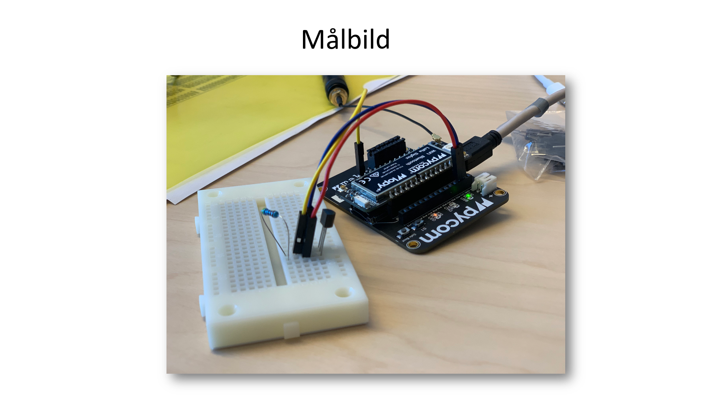
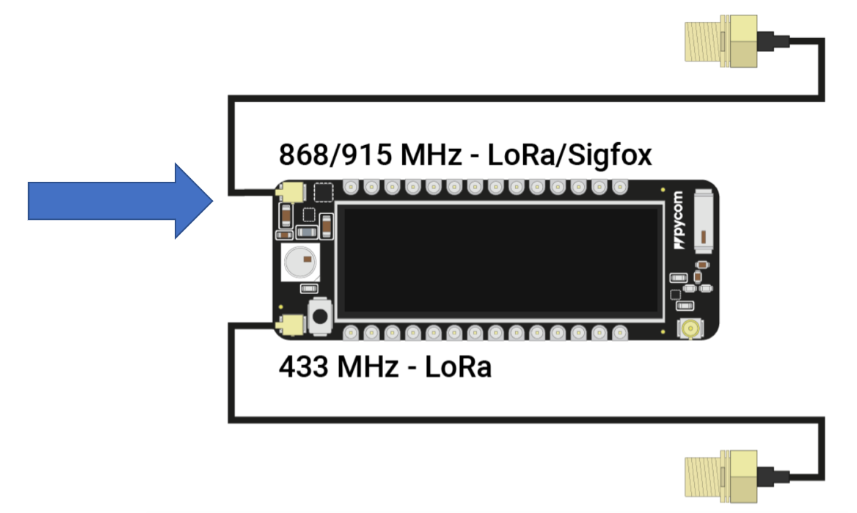

# Workshop
Workshop examples, Pycom


## Hardware
- Pycomboard ([Documentation](https://docs.pycom.io/gettingstarted/introduction.html))
- Antenna
- Sensors

## Development Tools
- [Atom.io](https://atom.io/) + [pymakr](https://pycom.io/solutions/software/pymakr/) or [Visual Studio Code](https://code.visualstudio.com/) + [pymakr](https://pycom.io/solutions/software/pymakr/)
- [Micropython](https://micropython.org/)
- MQTT

## Services
- [The Things Network](https://www.thethingsnetwork.org/)
- [Grafana](https://grafana.com/)

# Step By Step
## 1 - Assemble the hardware (Pycom board)
Start by connecting the Pycom to the expantion board and then connect the antenna to the Pycom board as shown in the picture:


## 2 - Install the development tools
Install an IDE. We recommend Atom.io or Visual Studio Code.
Open the IDE and install the plugin Pymakr.

If on Mac or Linux there could be a problem connecting to the serial port (usb) on your computer. This is due to a incompatibility in the Pymakr plugin. It could be fixed by information you find in [update-electron.txt](./update-electron.txt)

## 3 - Connect to the Pycom board

## 4 - Create an application on TTN

### Dev EUI - Get the Mac address
```
from network import LoRa
import ubinascii
lora = LoRa (mode=LoRa.LORAWAN)

ubinascii.hexlify(lora.mac())
```
